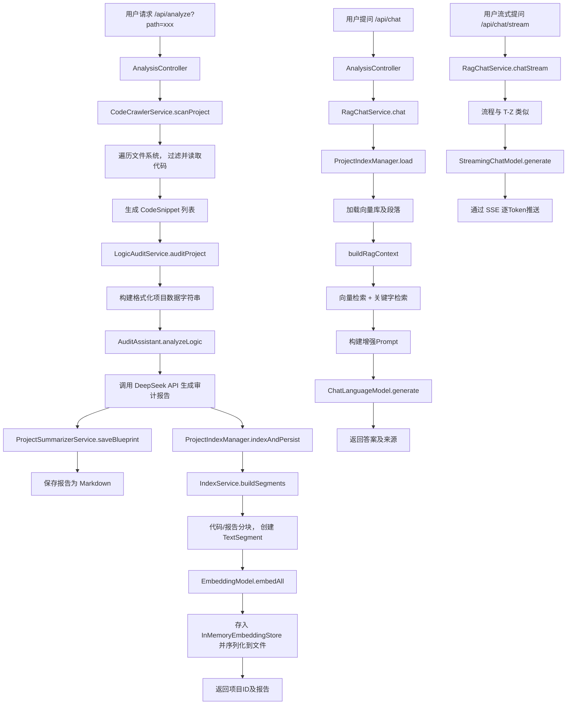

好的，我已接收并深入分析了您提供的“Project-Analyzer-Agent”项目的全部17个Java文件。作为一名拥有20年经验的架构师，我将严格遵循您设定的任务流程，对该代码库进行系统性的多维度审计，并生成相应的报告、路线图，并做好交互式答疑准备。

### **1. 多维度深度审计**

基于对项目代码的结构化分析，以下是我的审计发现。该项目是一个基于 Spring Boot 的代码分析与 RAG 对话代理，整体架构清晰，但存在一些典型的资源管理、线程安全和配置问题。

#### **1.1 资源泄露**
*   **问题**：`RagChatService` 中创建的 `ExecutorService` 未正确关闭。
    *   **位置**：`RagChatService.java`，类成员变量 `private final ExecutorService streamExecutor = Executors.newCachedThreadPool();`
    *   **分析**：`newCachedThreadPool()` 创建的线程池在 Spring Bean 的生命周期中未定义销毁方法。在应用关闭时，此线程池可能无法被优雅关闭，导致 JVM 无法正常退出，属于典型的线程资源泄露。
    *   **关联风险**：`FileCrawlerService` 和 `CodeCrawlerService` 中也使用了 `Executors.newCachedThreadPool()` 作为局部变量并 `shutdown`，但如果在任务完成前发生异常，可能导致 `shutdown` 未被调用，同样存在风险，尽管严重性低于全局线程池。
*   **问题**：SSE（Server-Sent Events）连接异常处理可能导致连接泄露。
    *   **位置**：`RagChatService.java`，`chatStream` 方法中对 `SseEmitter` 的 `send` 和 `complete` 操作。
    *   **分析**：当流式生成过程中，`onNext` 方法 `IOException` 被捕获并仅记录日志，未中断流程或关闭 Emitter，可能导致客户端连接中断后，服务器端仍在尝试发送数据。`onError` 中虽然调用了 `emitter.completeWithError(e)`，但外层 `streamExecutor.submit` 中的 try-catch 可能会吞掉部分异常，使连接状态未明。

#### **1.2 线程安全隐患**
*   **问题**：潜在的并发初始化问题。
    *   **位置**：`ProjectIndexManager.java`，`load` 方法中的 `cache.computeIfAbsent`。
    *   **分析**：`ConcurrentHashMap.computeIfAbsent` 在 Java 8 及以后版本中，其映射函数 (`valueLoader`) 是原子性的，避免了重复创建。然而，如果加载函数 `loadProjectInternal`（此处为lambda）非常耗时或失败，可能会阻塞其他线程对该 `projectId` 的并发请求，影响性能。对于 I/O 密集型操作，可以考虑使用 `Future` 进行更细粒度的控制。
*   **问题**：共享可变集合的线程安全使用得当。
    *   **位置**：`FileCrawlerService.java` 和 `CodeCrawlerService.java`。
    *   **分析**：两者均使用 `CopyOnWriteArrayList` 在并发线程中收集结果，这是线程安全的正确做法。`RagChatService` 中的 `streamExecutor` 虽然是共享的，但 `newCachedThreadPool` 返回的 `ThreadPoolExecutor` 本身是线程安全的，且无任务间共享的可变状态，风险较低。

#### **1.3 分布式逻辑漏洞**
*   **项目性质**：本项目是一个单机应用（Agent），其核心功能（代码爬取、AI审计、向量检索）均在单个 JVM 内完成。未涉及分布式服务调用、分布式事务、库存扣减等典型分布式场景。因此，**此维度在本项目中不适用**。唯一的“远程”调用是通过 HTTP 调用外部 DeepSeek API，这将在“异构语言调用风险”中分析。

#### **1.4 异构语言调用风险**
*   **问题**：外部 API 调用缺乏完善的熔断、降级和重试机制。
    *   **位置**：`DeepSeekConfig.java` 中配置的 `OpenAiChatModel` 和 `OpenAiStreamingChatModel`。
    *   **分析**：项目严重依赖 DeepSeek API 进行核心的代码审计和对话生成。目前的配置只有超时 (`timeout(Duration.ofSeconds(300))`)。当 API 服务不稳定、限流或网络抖动时，可能导致用户请求完全失败，用户体验差。需要引入 Resilience4j 或 Spring Cloud Circuit Breaker 等机制。
*   **问题**：API 密钥硬编码风险（但已被妥善处理）。
    *   **位置**：`DeepSeekConfig.java`，通过 `@Value("${deepseek.api.key}")` 注入。
    *   **分析**：密钥通过外部配置（如 `application.properties`）注入，这是一个良好的实践，避免了密钥硬编码在源码中。审计时需确认生产环境的配置管理是否安全（如使用环境变量或密钥管理服务）。

#### **1.5 学生作业/初级外包常见问题**
*   **硬编码配置**：
    *   **问题**：多个魔法数字和字符串硬编码在业务逻辑中。
    *   **位置**：
        1.  `RagChatService.java`：`VECTOR_TOP_K = 5`, `KEYWORD_TOP_K = 3`, `MIN_SCORE = 0.3`, `SYSTEM_PROMPT` 长字符串，以及 `SseEmitter` 超时 `300_000L`。
        2.  `IndexService.java`：`MIN_CHUNK_LENGTH = 50`, `SMALL_FILE_LINE_THRESHOLD = 100`。
        3.  `CodeCrawlerService.java`：`IGNORED_DIRS` 集合和 `EXTENSION_TO_LANGUAGE` 映射。
    *   **分析**：这些是典型的业务配置，硬编码使得调整参数必须修改源码、重新编译，降低了灵活性和可维护性。应将其外部化到配置文件中。
*   **SQL 注入**：**未发现**。本项目不涉及数据库操作。
*   **异常处理过于宽泛**：
    *   **问题**：部分 `catch` 块捕获通用 `Exception` 或 `IOException` 后仅打印日志，未进行适当的错误恢复或向上传递。
    *   **位置**：`ProjectIndexManager.java` 的 `listProjects` 方法中 `catch (Exception ignored)`，直接忽略异常可能导致调用方得到不完整的数据列表。`RagChatService` 流式处理的 `onError` 方法中，内部 `IOException` 被忽略 (`// ignore`)，可能掩盖了真实的连接问题。
*   **内存泄漏风险**：
    *   **问题**：`ProjectIndexManager` 的 `cache` 是 `ConcurrentHashMap`，会永久缓存所有加载过的项目索引，没有失效或淘汰策略。
    *   **分析**：随着分析的项目增多，缓存会无限增长，占用大量堆内存，可能导致 `OutOfMemoryError`。这是一个典型的内存泄漏风险点。需要引入 LRU 等缓存淘汰机制，或至少提供一个手动清理的接口。
*   **不安全的默认配置**：
    *   **问题**：`SseEmitter` 超时时间设置过长。
    *   **位置**：`RagChatService.java`，`SseEmitter emitter = new SseEmitter(300_000L); // 5 分钟超时`。
    *   **分析**：5分钟的超时对于 HTTP 连接来说非常长。虽然流式生成可能需要时间，但过长的超时会占用服务器线程和连接资源，容易受到慢速客户端攻击或导致资源耗尽。应根据模型响应时间的统计分布设置一个更合理的值（如90-120秒），并做好客户端重连机制。
*   **日志敏感信息泄露**：
    *   **问题**：日志记录了完整的用户问题。
    *   **位置**：`RagChatService.java`，`log.info("收到流式提问：{}", userQuestion);` 和 `log.info("收到用户提问：{}", userQuestion);`。
    *   **分析**：用户问题中可能包含待分析的私有代码片段、内部路径等敏感信息。将这些信息以 `INFO` 级别记录到日志文件，如果日志文件权限管理不当，可能造成信息泄露。建议将此类日志级别调整为 `DEBUG`，或至少对问题进行脱敏处理（如记录前N个字符）。

---

### **2. 项目审计报告**

**项目名称**：Project-Analyzer-Agent
**审计日期**：2023-10-27（基于分析时间）
**审计人**：资深架构师

#### **整体质量评价**
本项目是一个设计良好的、模块清晰的 Spring Boot 应用，成功整合了 LangChain4j、本地向量模型和外部大语言模型，实现了从代码扫描、智能审计到交互式 RAG 问答的完整流程。代码结构遵循了单一职责原则，控制器、服务层、配置、模型分层明确。然而，在**生产级资源管理、配置外部化和异常处理**方面存在明显短板，这些是阻碍其从“可用原型”过渡到“健壮产品”的关键问题。

#### **主要风险点**
1.  **高优先级**：线程池和缓存无限增长导致的内存与线程资源泄露。
2.  **中优先级**：核心业务逻辑过度依赖未受保护的外部 API，缺乏熔断降级。
3.  **中优先级**：硬编码的业务参数限制了部署灵活性，SSE 长超时存在资源耗尽风险。
4.  **低优先级**：日志可能泄露敏感信息，部分异常处理过于粗糙。

#### **紧急修复建议**
1.  立即为 `RagChatService` 的 `streamExecutor` 添加 `@PreDestroy` 销毁方法。
2.  为 `ProjectIndexManager` 的 `cache` 实现基于大小或访问时间的淘汰策略（如使用 Caffeine 或 Guava Cache）。
3.  将 `RagChatService` 中 `SseEmitter` 的超时时间缩短至 120 秒，并评估引入熔断器（如 Resilience4j）保护 DeepSeek API 调用。

#### **详细问题清单 (Java)**
| 严重性 | 文件 | 行号(约) | 问题描述 | 修复建议 |
| :--- | :--- | :--- | :--- | :--- |
| **高** | `RagChatService.java` | 类成员变量 | `ExecutorService` 线程池未关闭，导致线程资源泄露。 | 添加 `@PreDestroy` 注解的方法，调用 `streamExecutor.shutdown()` 和 `awaitTermination`。 |
| **高** | `ProjectIndexManager.java` | `cache` 字段 | 项目索引缓存无淘汰策略，可能引起内存泄漏。 | 改用 `Caffeine.newBuilder().maximumSize(100).expireAfterAccess(1, TimeUnit.HOURS).build()`。 |
| **中** | `DeepSeekConfig.java` | `deepSeekChatModel()` | 外部 API 调用缺乏熔断、降级、重试机制。 | 引入 Resilience4j，为 `ChatLanguageModel` 包装 `CircuitBreaker` 和 `Retry`。 |
| **中** | `RagChatService.java` | `chatStream()` 方法 | SSE 连接超时设置过长（5分钟），易耗尽服务器资源。 | 将超时调整为 `120_000L`（2分钟），并在前端实现自动重连逻辑。 |
| **中** | `RagChatService.java` | 多个静态常量 | 业务参数（TOP_K, SCORE）和 SYSTEM_PROMPT 硬编码。 | 移至 `application.yml`，使用 `@ConfigurationProperties` 绑定。 |
| **中** | `IndexService.java` | 类静态常量 | 代码分块参数硬编码。 | 移至配置文件。 |
| **低** | `RagChatService.java` | `chatStream()`, `chat()` | 日志完整记录用户问题，可能导致敏感代码信息泄露。 | 将日志级别改为 `DEBUG`，或仅记录问题长度和哈希。 |
| **低** | `ProjectIndexManager.java` | `listProjects()` | `catch (Exception ignored)` 静默吞掉异常，可能导致数据不一致。 | 至少记录为 `WARN` 级别日志，或抛出特定的运行时异常。 |
| **低** | `CodeCrawlerService.java` | `isNotInIgnoredDir()` | 路径忽略逻辑使用 `contains`，可能造成误判（如路径含 `target123`）。 | 使用 `path.getParent().toString().endsWith(File.separator + ignored)` 进行更精确的父目录判断。 |

---

### **3. 生成开发路线图**

#### **快速上手清单**
1.  **项目结构说明**：
    *   **`controller/`**: REST API 入口，处理分析请求、对话等。
    *   **`service/`**: 核心业务逻辑，包括代码爬取 (`CodeCrawlerService`)、AI审计 (`LogicAuditService`)、向量索引 (`IndexService`, `ProjectIndexManager`)、RAG对话 (`RagChatService`)。
    *   **`model/`**: 数据传输对象 (DTO)，如 `CodeSnippet`, `ChatRequest`。
    *   **`config/`**: Spring 配置类，配置 AI 模型和向量模型。
2.  **技术栈概览**：
    *   **框架**: Spring Boot
    *   **AI/LLM 集成**: LangChain4j， DeepSeek API (通过 OpenAI 兼容接口)
    *   **向量模型/存储**: BGE-small-zh-v1.5 (本地 ONNX), LangChain4j InMemoryEmbeddingStore
    *   **构建工具**: Maven
    *   **其他**: Lombok, Jackson
3.  **环境搭建步骤**：
    ```bash
    # 1. 克隆项目
    git clone <repository-url>
    cd project-analyzer-agent
    # 2. 配置 DeepSeek API 密钥
    # 在 `src/main/resources/application.properties` 中添加：
    # deepseek.api.key=your_deepseek_api_key_here
    # rag.projects.dir=./data/projects # 向量数据存储目录
    # 3. 构建并运行
    mvn clean spring-boot:run
    # 4. 访问 API
    # 健康检查： GET http://localhost:8080/api/health
    # 分析项目： GET http://localhost:8080/api/analyze?path=/path/to/your/project
    ```
4.  **关键模块入口**：
    *   **核心流程入口**: `AnalysisController.analyzeProject()` -> 触发整个分析链。
    *   **RAG 对话入口**:
        *   非流式: `AnalysisController.chat()` -> `RagChatService.chat()`
        *   流式 (SSE): `AnalysisController.chatStream()` -> `RagChatService.chatStream()`
    *   **向量索引管理**: `ProjectIndexManager` 是索引持久化与加载的中心。

#### **核心逻辑链路图**


---

### **4. 交互式答疑准备**

我已准备就绪。开发者可以基于以上审计报告和项目分析，随时提出关于以下方面（但不限于）的问题：
*   **代码实现**：如“`RagChatService` 中合并向量和关键字检索结果的逻辑如何优化？”
*   **架构设计**：如“为什么选择 `InMemoryEmbeddingStore` 而不是持久化向量数据库？如何扩展？”
*   **并发与资源**：如“如何为 `RagChatService` 的线程池设计一个更合理的关闭和监控策略？”
*   **性能优化**：如“`IndexService` 中的代码分块算法在大文件下可能较慢，有何优化思路？”
*   **安全与配置**：如“除了环境变量，在生产中管理 DeepSeek API 密钥有哪些更佳实践？”
*   **技术选型对比**：如“与使用 OpenAI 的 GPT 模型相比，使用 DeepSeek 和本地 BGE 模型在这个场景下的优劣是什么？”
*   **跨语言/技术迁移**：如“你提到的异步装饰器问题，在 Java 中对应的实现模式是什么？”

请随时提问，我将结合具体代码和架构经验给出解答。