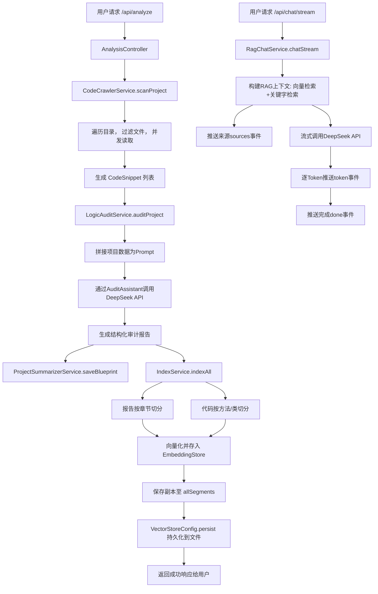

# 项目审计分析报告 - Project Analyzer Agent

## 1. 多维度深度审计

基于对提供的16个Java文件的详细分析，以下是从多个维度进行的深度审计结果。该项目是一个基于Spring Boot的代码审计与智能问答系统，架构设计良好，但仍存在一些典型问题。

### 1.1 资源泄露
- **问题1：未关闭的ExecutorService**
    - **位置**: `/home/cqy/project-analyzer-agent/src/main/java/com/bupt/cqy/analyzer/service/RagChatService.java` (第35行)
    - **描述**: `RagChatService` 中通过 `Executors.newCachedThreadPool()` 创建了一个缓存线程池 (`streamExecutor`)，但该服务类没有提供关闭此线程池的方法（如 `@PreDestroy` 注解的方法）。`newCachedThreadPool()` 会创建可缓存的线程，在长期运行的应用中可能导致线程数量无限制增长或资源无法回收。
    - **结合调用图**: `streamExecutor` 用于提交SSE流式处理任务。当应用关闭时，如果线程池未被关闭，正在执行或等待的任务可能被强制中断，导致响应未完全发送，且线程资源泄露。
    - **修复建议**:
        1. 在 `RagChatService` 中添加一个使用 `@PreDestroy` 注解的方法来关闭线程池。
        2. 考虑使用Spring管理的 `ThreadPoolTaskExecutor` 代替原生的 `ExecutorService`，以便与Spring生命周期集成。

- **问题2：潜在的SseEmitter资源泄露**
    - **位置**: `/home/cqy/project-analyzer-agent/src/main/java/com/bupt/cqy/analyzer/service/RagChatService.java` (`chatStream` 方法)
    - **描述**: `SseEmitter` 设置了5分钟的超时(300_000L)。如果在流式传输过程中发生客户端断开、网络错误或服务端异常，`emitter.complete()` 或 `emitter.completeWithError(e)` 可能不会在所有分支都被调用，导致 `SseEmitter` 持有的资源（如HTTP连接）无法及时释放。
    - **修复建议**:
        1. 使用 `try-catch-finally` 块确保在异常路径下也调用 `emitter.complete()`。
        2. 为 `SseEmitter` 注册超时和完成回调，在回调中清理相关资源。
        3. 考虑使用Spring的 `SseEmitter` 与 `ResponseBodyEmitter` 的超时和错误处理最佳实践。

- **问题3：CodeCrawlerService中的线程池未妥善关闭**
    - **位置**: `/home/cqy/project-analyzer-agent/src/main/java/com/bupt/cqy/analyzer/service/CodeCrawlerService.java` (`scanProject` 方法)
    - **描述**: 方法内创建了一个 `Executors.newCachedThreadPool()`，并通过 `executor.awaitTermination(120, TimeUnit.SECONDS)` 等待。如果任务在120秒内未完成，会调用 `executor.shutdownNow()`。然而，`shutdownNow()` 会尝试中断正在执行的任务，对于文件读取这类阻塞IO操作，中断可能无效，导致线程无法结束，造成资源悬挂。
    - **修复建议**:
        1. 使用 `ExecutorService` 时，优先考虑使用具有固定大小或受限队列的线程池（如 `newFixedThreadPool`），避免无限制增长。
        2. 将文件读取这类可能长时间阻塞的操作封装为可响应中断的形式，或为 `awaitTermination` 设置更合理的超时时间。

### 1.2 线程安全隐患
- **问题1：共享的缓存线程池**
    - **位置**: `RagChatService` 中的 `streamExecutor`
    - **描述**: `streamExecutor` 被声明为 `private final`，由所有调用 `chatStream` 方法的请求共享。`newCachedThreadPool()` 底层使用 `SynchronousQueue`，在高并发场景下，大量任务的提交可能导致创建大量线程，消耗系统资源，甚至引发 `OutOfMemoryError`。
    - **虚拟线程兼容性**: 当前代码使用平台线程。如果迁移到Java虚拟线程，`newCachedThreadPool()` 的行为和性能特征将发生巨大变化，需要重新评估。
    - **修复建议**:
        1. 改用有界线程池，例如 `Executors.newFixedThreadPool`，并根据系统资源设置合理的核心线程数。
        2. 如果计划使用虚拟线程，应使用 `Executors.newVirtualThreadPerTaskExecutor()`。

- **问题2：IndexService中allSegments的并发更新**
    - **位置**: `/home/cqy/project-analyzer-agent/src/main/java/com/bupt/cqy/analyzer/service/IndexService.java` (`indexAll` 方法，第52、68行)
    - **描述**: `allSegments` 是一个 `CopyOnWriteArrayList`，用于支持并发读取。但在 `indexAll` 方法中，首先调用了 `allSegments.clear()`，然后最后调用 `allSegments.addAll(segments)`。如果在这两个操作之间有其他线程（例如正在处理的关键字检索）调用 `getAllSegments()`，将会得到一个空列表，导致检索失败或返回空结果。
    - **修复建议**:
        1. **原子性更新**：将清空和添加操作封装在一个原子操作中。可以创建一个新的 `CopyOnWriteArrayList` 实例，填充数据后再将其原子性地赋值给 `allSegments` 引用（需将 `allSegments` 改为 `volatile` 或使用原子引用）。
        2. **加锁**：在 `indexAll` 和 `getAllSegments` 方法上使用 `synchronized` 关键字，确保更新和读取的互斥性（会影响并发读取性能）。

### 1.3 分布式逻辑漏洞
- **不适用**：当前项目是单体Spring Boot应用，主要功能是代码分析和本地向量检索，未涉及跨服务调用、分布式事务或库存扣减等典型分布式场景。但向量库的持久化(`VectorStoreConfig`)可以视为一种简单的数据存储。
    - **潜在风险**：`VectorStoreConfig.persist()` 方法被 `@PreDestroy` 和手动调用。如果在索引进行中（`indexAll`）同时发生应用关闭，可能会保存不完整的向量库状态。这不是严格意义上的分布式事务问题，而是状态一致性问题。
    - **建议**：考虑将索引过程设计为原子操作，要么全部成功并持久化，要么全部失败回滚（在内存模型中）。

### 1.4 异构语言调用风险
- **不适用**：项目全部由Java实现，未涉及JNI、多语言RPC等异构调用。

### 1.5 学生作业/初级外包常见问题
- **问题1：硬编码的阈值与配置**
    - **位置**: 多个Service类中（如 `RagChatService` 中的 `VECTOR_TOP_K`, `MIN_SCORE`；`IndexService` 中的 `SMALL_FILE_LINE_THRESHOLD`）。
    - **描述**: 这些配置参数以静态常量的形式硬编码在类中。当需要根据不同的部署环境（开发、测试、生产）或不同规模的代码库进行调整时，必须修改源代码并重新编译部署。
    - **修复建议**: 将这些配置项移至 `application.properties` 或 `application.yml` 文件中，并使用 `@Value` 注解或 `@ConfigurationProperties` 在运行时注入。

- **问题2：异常处理过于宽泛或缺失**
    - **位置1**: `RagChatService.chatStream()` 方法中的最外层 `try-catch (Exception e)`。
        - **描述**：捕获了通用的 `Exception`，虽然进行了错误日志记录和 `emitter.completeWithError(e)`，但丢失了具体的异常类型信息，不利于问题定位和差异化处理（如网络超时 vs 模型调用失败）。
    - **位置2**: `FileCrawlerService.crawl()` 方法中，在读取文件内容时捕获 `IOException` 后直接空处理（`// skip unreadable files`）。
        - **描述**：静默忽略错误使得调用方无法感知有哪些文件处理失败，不利于调试和监控。
    - **修复建议**:
        1. 细化异常捕获，针对不同的异常类型（如 `IOException`, `TimeoutException`, `RuntimeException` 的子类）采取不同的处理策略（重试、降级、快速失败）。
        2. 至少将跳过的文件路径记录到WARN级别日志中。
        3. 考虑使用Spring的全局异常处理器 (`@ControllerAdvice`) 统一处理控制器层的异常。

- **问题3：潜在的日志敏感信息泄露**
    - **位置**: `RagChatService` 和 `LogicAuditService` 的日志中记录了用户问题 (`userQuestion`)。
    - **描述**：用户的问题可能包含敏感的代码路径、内部IP、业务关键词等信息。将这些信息以 `INFO` 级别记录到日志文件中，如果日志文件权限设置不当或被意外收集，可能导致信息泄露。
    - **修复建议**:
        1. 避免在日志中直接记录完整的用户输入。可以记录其哈希值、长度或脱敏后的摘要。
        2. 如果出于调试目的必须记录，应将其日志级别调整为 `DEBUG`，并确保生产环境不输出 `DEBUG` 日志。

- **问题4：不安全的默认配置 - SseEmitter超时**
    - **位置**: `RagChatService.chatStream()` 中创建 `SseEmitter(300_000L)`。
    - **描述**：5分钟的超时对于HTTP长连接来说非常长。在公网环境下，这可能导致大量的挂起连接消耗服务器资源（如文件描述符），易受到慢速客户端攻击（Slow HTTP DoS）。
    - **修复建议**: 根据实际模型响应时间和网络状况，设置一个更合理的超时时间（例如30-60秒），并考虑在客户端实现心跳机制和断线重连。

## 2. 项目审计报告

### 整体质量评价
该项目（Project Analyzer Agent）是一个设计思路清晰、模块划分合理的Spring Boot应用，成功整合了LangChain4j、本地向量模型和DeepSeek API，实现了代码审计和智能问答的核心功能。代码结构规范，使用了Lombok、构造函数注入等现代Java开发实践。**整体质量中等偏上**。

### 主要风险点
1.  **资源管理风险**：多处使用了未妥善管理生命周期的 `ExecutorService` 和 `SseEmitter`，在长时间运行或高并发下可能导致线程泄露和连接泄露。
2.  **并发设计风险**：`IndexService` 中并发更新 `allSegments` 的逻辑存在竞态条件，可能导致服务短时不可用或返回错误数据。
3.  **配置僵化**：关键参数硬编码，降低了部署和调优的灵活性。
4.  **异常处理粗糙**：部分异常被泛化捕获或静默忽略，降低了系统的可观测性和可维护性。

### 紧急修复建议（优先级：高）
1.  **立即修复 `IndexService` 的并发问题**：采用“原子引用替换”或“加锁”方案修复 `indexAll` 方法，防止在索引重建时出现空指针或数据不一致。
2.  **为所有 `ExecutorService` 添加关闭钩子**：在 `RagChatService` 和优化 `CodeCrawlerService` 的线程池，确保应用关闭时能平滑终止。
3.  **调整SseEmitter超时时间**：将超时从300秒减少到更合理的范围（如60秒），并评估是否需要前端配合实现心跳。

### 详细问题列表（按严重性）

| 严重性 | 文件路径 | 行号(约) | 问题描述 | 修复建议 |
| :--- | :--- | :--- | :--- | :--- |
| **中** | `RagChatService.java` | 35 | 缓存线程池 (`streamExecutor`) 未关闭，可能导致线程泄露。 | 添加 `@PreDestroy` 方法调用 `shutdown()` 和 `awaitTermination`，或改用Spring管理的 `ThreadPoolTaskExecutor`。 |
| **中** | `IndexService.java` | `indexAll` 方法 | `allSegments.clear()` 和 `addAll()` 非原子操作，并发读可能导致空结果。 | 使用原子引用或同步块确保更新操作的原子性。 |
| **中** | `CodeCrawlerService.java` | `scanProject` 方法 | 使用 `shutdownNow()` 可能无法正确中断文件IO线程，且线程池未复用。 | 改用有界线程池，并考虑将线程池提升为Bean供复用。 |
| **低** | `RagChatService.java` | `chatStream` 方法 | SseEmitter 5分钟超时过长，存在Slow HTTP DoS风险。 | 缩短超时（如60秒），前端增加心跳/重连。 |
| **低** | 多个Service类 | - | 配置参数（如 TOP_K, MIN_SCORE）硬编码。 | 移至 `application.yml` 配置文件。 |
| **低** | `RagChatService.java` `FileCrawlerService.java` | - | 异常捕获过于宽泛或静默忽略错误。 | 细化异常类型处理，至少记录被忽略的错误。 |
| **低** | `RagChatService.java` `LogicAuditService.java` | - | 日志中记录原始用户问题，可能泄露敏感信息。 | 避免记录完整输入，或仅在 `DEBUG` 级别记录。 |

## 3. 生成开发路线图

### 快速上手清单
1.  **项目结构说明**：
    - **技术栈**：Spring Boot 3.x, Java 17+, LangChain4j, BGE小型中文向量模型(ONNX), DeepSeek API。
    - **核心包**:
        - `controller.AnalysisController`: 提供所有REST API入口。
        - `service`:
            - `CodeCrawlerService`: 扫描项目文件。
            - `LogicAuditService`: 协调调用AI生成审计报告。
            - `IndexService`: 将报告和代码切片向量化。
            - `RagChatService`: 提供基于向量的问答和流式问答。
        - `config`: 深度学习和向量存储配置。
        - `model`: 数据传输对象。

2.  **环境搭建步骤**：
    ```bash
    # 1. 确保 Java 17+ 和 Maven 已安装
    # 2. 克隆项目（假设）
    # 3. 配置 DeepSeek API Key
    # 在 `src/main/resources/application.yml` 中添加：
    # deepseek:
    #   api:
    #     key: your-api-key-here
    # 4. 构建并运行
    mvn clean package
    java -jar target/project-analyzer-agent-*.jar
    # 5. 访问 http://localhost:8080 (假设默认端口)
    ```

3.  **关键模块入口**：
    - **启动全流程分析**：向 `GET /api/analyze?path=/your/project/root` 发送请求。
    - **进行单文件分析**：向 `POST /api/analyze-snippet` 发送JSON格式的 `CodeSnippet`。
    - **进行智能问答**：向 `POST /api/chat` 发送问题，或连接 `GET /api/chat/stream?question=你的问题` 进行流式问答。
    - **浏览目录**：`GET /api/browse?path=/some/path`。

### 核心逻辑链路图



## 4. 交互式答疑准备

作为架构专家，我已准备就绪。以下是根据当前代码库可能预见的问题及其解答要点：

**Q1: “`RagChatService` 中的 `newCachedThreadPool()` 为什么会有问题？换成 `newVirtualThreadPerTaskExecutor()` 会更好吗？”**
**A1:** `newCachedThreadPool()` 使用 `SynchronousQueue`，每来一个任务，如果没有空闲线程就会创建新线程。在突发高并发下，可能瞬间创建大量线程，耗尽内存或CPU调度资源。`newVirtualThreadPerTaskExecutor()`（Java 19+）为每个任务创建轻量级虚拟线程，理论上可以支持极高并发（数百万），且资源消耗远低于平台线程。**迁移建议**：如果运行在Java 21+且项目是IO密集型（大量网络调用等待DeepSeek API），迁移到虚拟线程是一个非常好的选择，可以显著提升并发能力。但需注意，虚拟线程对阻塞操作的封装（如同步IO）有要求。

**Q2: “`IndexService.allSegments` 使用 `CopyOnWriteArrayList`，为什么还会有并发问题？”**
**A2:** `CopyOnWriteArrayList` 保证了**读**操作的并发安全，因为它每次读取的都是一个不变的快照。但**写**操作（如 `clear()` 和 `addAll()`）不是原子的。问题在于 `indexAll()` 方法包含了 `clear()`（写）和后续 `addAll()`（写）两个独立操作。如果另一个线程在这两个操作之间执行 `getAllSegments()`（读），它就会读到这个“中间状态”——一个空列表。解决方案是让这两个写操作对读操作来说看起来是瞬间完成的，即原子性更新。

**Q3: “`SseEmitter` 设置5分钟超时有什么风险？应该如何优化？”**
**A3:** 主要风险是**资源耗尽型拒绝服务**。恶意客户端可以建立大量连接并保持沉默，服务器会维持这些连接直至超时，消耗线程、内存和文件描述符。**优化方案**：1. **缩短超时**：根据LLM平均响应时间设置，如30-60秒。2. **客户端心跳**：前端定期发送注释事件（如 `event: ping`）来保持连接活跃，服务器端可重置超时计时器。3. **服务器端限流**：限制每个客户端的并发连接数。4. **使用更专业的协议**：对于需要超长时交互，考虑WebSocket。

**Q4: “向量库持久化文件 (`vector-store.json`) 在部署到容器时需要注意什么？”**
**A4:** 容器是无状态的，重启后文件会丢失。**关键点**：必须将持久化文件的目录（如 `./data`）挂载到宿主机或持久化卷（如Kubernetes的 `PersistentVolumeClaim`）上。否则，每次容器重启，之前索引的向量数据都会丢失，需要重新执行 `/api/analyze` 来构建，这非常耗时。此外，在多副本部署时，每个Pod有自己的文件，会导致数据不一致。对于生产环境，应考虑使用外置的向量数据库（如Redis, Pinecone, PGVector）。

**Q5: “`keywordSearch` 方法中的权重评分算法（路径×3）合理吗？如何改进？”**
**A5:** 给予路径、类名、方法名更高权重（×3）是合理的直觉，因为它们在定位代码时比普通文本更具特异性。但这仍是基于字符串包含的简单匹配。**改进方向**：1. **引入更精确的词法分析**：使用正则或简单解析器提取真正的标识符，避免部分匹配。2. **使用倒排索引**：为所有片段中的标识符（路径、类名、方法名、变量名）建立倒排索引，实现更快速和准确的布尔检索。3. **结合BM25/词频算法**：对普通文本内容使用更成熟的相关性评分算法。

我已准备就绪，您可以随时提出关于本项目代码、架构设计或Java开发实践的任何问题。