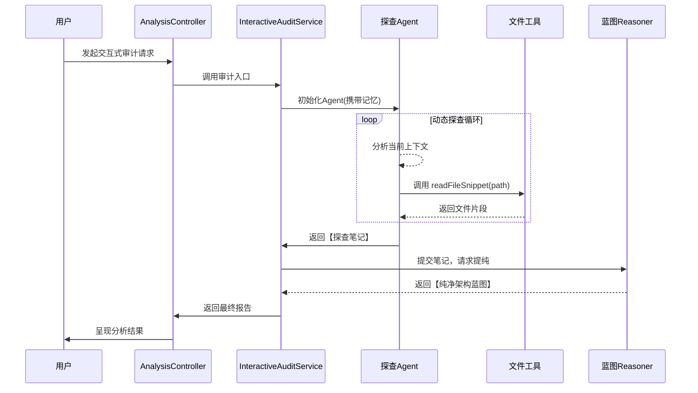

# 完整项目分析蓝图 (Project Blueprint)

## 一、项目核心定义
**项目名称**：Project Insight Agent (项目洞察智能体)
**核心定位**：基于大语言模型(LLM)与检索增强生成(RAG)的智能代码审计与架构分析平台。
**根本目标**：通过自动化探查与深度推理，将项目源码转换为结构化、可查询的知识，并提供智能化的分析与问答能力。

## 二、技术栈总览

| 类别 | 核心技术 | 作用与版本 |
| :--- | :--- | :--- |
| **基础框架** | Spring Boot 3.x | 应用主体框架，提供依赖注入、Web服务等基础设施。 |
| **AI 集成框架** | LangChain4j | 构建AI智能体(Agent)、工具调用(Tool Calling)及服务编排的核心框架。 |
| **大语言模型** | DeepSeek API | 提供核心推理能力。项目策略性地使用了三个端点。 |
| **向量化/检索** | In-Memory Embedding Store | 存储文档向量，实现语义检索。当前为内存存储。 |
| **前端** | (推测) Vue/React + Tailwind CSS | 基于独立的`tailwind.config.js`与`postcss.config.js`文件，存在现代化前端界面。 |
| **构建/依赖** | Maven/Gradle | Java项目标准构建工具。 |

## 三、架构分层与核心组件

### 3.1 控制器层 (Controller Layer)
作为系统统一的HTTP API门面，接收并分发所有客户端请求。

*   **`AnalysisController`**：唯一的核心控制器，聚合了所有业务能力。
    *   端点包括：项目加载/地图生成、交互式审计、逻辑审计、RAG对话（流式/非流式）等。
    *   采用Spring Boot的`@RestController`与`@RequestMapping`标准范式。

### 3.2 服务层 (Service Layer)
系统的业务逻辑核心，采用**服务模式**进行高度模块化设计。

| 服务组件 | 核心职责 | 关键设计思想 |
| :--- | :--- | :--- |
| **`InteractiveAuditService`** | **智能体驱动代码探查** | **两阶段架构**：1. **探查Agent**：利用`AiServices`构建，具备`readFileSnippet`工具与30轮记忆，动态决定探查路径。2. **推理Reasoner**：接收探查笔记，生成纯净架构报告。 |
| **`RagChatService`** | **RAG增强对话** | **混合检索策略**：1. **向量检索** (Top-K=10, Min-Score=0.6)。2. **关键词检索** (Top-K=5)。**优先级合并**：向量结果优先，合并去重，保证答案相关性。支持SSE流式响应。 |
| **`LogicAuditService`** | **静态代码逻辑分析** | **多语言结构化摘要**：对Java/Python/C++/Go代码进行方法/函数/类级别的分析，输出结构化摘要而非原始代码。 |
| **`CodeCrawlerService`** | **项目文件爬取** | **并行扫描与智能过滤**：多线程遍历文件系统，自动忽略`node_modules`, `.git`, `target`等构建目录，聚焦源文件。 |
| **`IndexService`** | **文档处理与索引** | **自适应分块策略**：Markdown按标题分块，代码按结构分块。`100行`以下文件不拆分，单块最小`50字符`。平衡检索粒度与上下文完整性。 |
| **`ProjectIndexManager`** | **项目索引生命周期管理** | **缓存与内存管理**：负责项目索引的加载、缓存与内存存储管理，是RAG系统的数据中枢。 |
| **`ProjectMapService`** | **项目骨架生成** | **架构可视化基础**：分析文件结构、语言统计，生成全局项目地图(`ProjectMap`)。 |
| **`ProjectSummarizerService`** | **项目概要总结** | （功能相对独立，基于LLM生成项目概述） |
| **`AuditAssistant`** | **审计辅助** | （轻量服务，可能封装特定审计提示词或流程） |
| **`FileCrawlerService`** | **基础文件爬取** | （可能被`CodeCrawlerService`复用或用于更基础的文件操作） |

### 3.3 模型层 (Model Layer)
定义领域对象与数据传输对象。

*   **`ProjectMap`**：项目骨架地图，包含`projectRoot`、`languageStats`、`totalFiles`、`entryPoints`及`files`列表。
*   **`CodeSnippet`**：代码片段模型，包含文件路径、语言类型和代码内容。
*   **`Document`**：索引文档模型，对应向量存储中的基本单元。
*   **`ChatRequest`/`ChatResponse`**：对话请求与响应DTO。
*   **`AuditReport`**：审计报告模型。

### 3.4 配置层 (Config Layer)
管理外部依赖与集成组件的配置。

*   **`DeepSeekConfig`**：**核心AI策略配置**。采用**双重模型策略**，针对不同场景优化资源与性能：
    | 模型别名 | 基础模型 | Context Window | 核心用途 | 设计考量 |
    |:---|:---|:---:|:---|:---|
    | `deepseek-reasoner` | DeepSeek-Reasoner | 64K | 生成最终项目蓝图、深度分析 | 处理长上下文，需深度推理 |
    | `deepseek-chat` | DeepSeek-Chat | 8K | `InteractiveAuditService`中的Agent工具调用 | 交互频繁，要求低延迟与成本 |
    | `deepseek-v3` | DeepSeek-V3 | (未明确) | `RagChatService`的流式对话 | 支持流式输出，优化用户体验 |
*   **`VectorStoreConfig`**：配置内存向量存储。

## 四、核心业务流程

### 4.1 智能审计流程

### 4.2 RAG问答流程
1.  **请求接收**：`AnalysisController`接收用户问题。
2.  **混合检索**：`RagChatService`并行执行向量检索（语义）与关键词检索（精确匹配）。
3.  **结果融合**：优先保留高相关度（分数≥0.6）的向量结果，并入关键词结果并去重。
4.  **上下文构建**：将检索到的文档片段与系统指令、用户问题组合成增强Prompt。
5.  **模型调用**：使用`deepseek-v3`模型生成答案，支持流式（SSE）或非流式返回。
6.  **溯源**：答案中可关联引用来源文档。

## 五、设计模式与架构思想

| 模式/思想 | 应用点 | 带来的优势 |
| :--- | :--- | :--- |
| **服务模式** | 所有`Service`组件 | 高内聚、低耦合，功能模块清晰，易于测试与维护。 |
| **策略模式** | 检索策略（向量/关键词）、分块策略（按标题/按结构） | 算法可独立变化和替换，系统扩展性强。 |
| **建造者模式** | `DeepSeekConfig`中模型客户端的构建 | 简化复杂对象的创建过程，提升配置可读性。 |
| **门面模式** | `AnalysisController`聚合所有服务接口 | 为客户端提供统一简化的入口，隐藏子系统复杂性。 |
| **分层架构** | Controller -> Service -> Model/Config | 明确职责边界，支持团队并行开发与技术栈分层升级。 |
| **智能体架构** | `InteractiveAuditService`中的Agent | 赋予系统自主决策与工具调用能力，实现动态、引导式的分析。 |
| **事件驱动** | SSE流式响应 | 实现服务器主动推送，提升长文本生成场景的用户体验。 |

## 六、技术风险评估与改进建议

| 风险类别 | 具体风险点 | 潜在影响 | 缓解/改进建议 |
| :--- | :--- | :--- | :--- |
| **性能与资源** | 使用**内存向量存储** | 分析大型项目时内存占用激增，可能引发OOM，且索引无法持久化。 | **引入持久化向量数据库**，如Milvus、PgVector、Chroma。实现冷热数据分层。 |
| **外部依赖** | **强耦合DeepSeek API** | 单点故障风险（API不可用、限流、变更），导致核心功能瘫痪。 | **1. 多模型降级**：集成OpenAI、Ollama等作为备选。 **2. 本地模型兜底**：对于简单分析，可使用本地轻量模型。 |
| **稳定性** | **流式响应超时（5分钟）** | 复杂项目分析或长对话可能超时，连接中断导致用户体验差。 | **支持可配置超时**，或改为异步任务模式，通过轮询或WebSocket获取结果。 |
| **鲁棒性** | **多线程文件扫描错误处理** | 文件权限、编码格式、畸形文件可能导致线程异常，影响整体扫描。 | 增强**细粒度异常捕获与日志记录**，实现线程级容错，不影响主流程。 |
| **安全与成本** | **API密钥与用量** | 配置硬编码或泄露风险，无用量监控可能导致意外成本。 | **1. 密钥安全管理**。 **2. 集成审计日志与用量监控**，设置用量告警。 |

## 七、结论：架构总评

本项目是一个**设计精良的现代AI应用范例**，成功地将传统代码分析技术与前沿的大语言模型、智能体、RAG技术深度融合。其架构清晰，模块化程度高，通过**双重模型策略**和**智能体两阶段工作流**展现了出色的资源优化与任务编排思想。核心价值在于将非结构化的代码仓库转化为**可交互、可查询、可深度分析的动态知识体**。

**主要优势**：
1.  **架构清晰**：分层与模块化设计便于理解、扩展和维护。
2.  **AI集成深度**：不仅是简单API调用，而是利用LangChain4j构建了具备记忆与工具调用能力的智能体。
3.  **策略考究**：混合检索、自适应分块、多模型分工等策略均针对业务场景做了优化。
4.  **用户体验考虑**：支持流式输出、交互式引导分析，提升了工具易用性。

**演进方向**：
当前的架构已奠定坚实基础。下一阶段的进化应聚焦于**降低外部依赖风险**（多模型/本地化）、**提升处理规模与性能**（持久化向量库）、以及**增强企业级特性**（监控、安全、异步处理）。